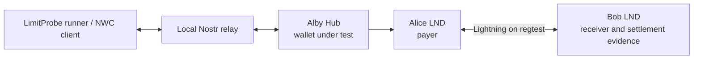

# NWC LimitProbe

**A black-box Nostr Wallet Connect spending-limit stress tester for AI-agent Lightning wallets.**

> **Can an AI agent overspend a Bitcoin wallet when multiple payments hit its spending limit at nearly the same time?**

LimitProbe tests that boundary by releasing concurrent Lightning payment requests against a constrained NWC wallet, then checking settlement independently. It tests the guardrail; it is not the guardrail.

## Try it

- **[Open the dashboard](https://nwc-limitprobe.vercel.app)** — run the configurable browser sandbox or inspect the verified live result.
- **[Read the docs](https://nwc-limitprobe.vercel.app/docs)** — project flow, evidence model, and limitations.
- **[View verified evidence](https://nwc-limitprobe.vercel.app/reports/phase6.2-final-evidence.json)** — redacted JSON for the live run. The same report is in [`reports/phase6.2-final-evidence.json`](reports/phase6.2-final-evidence.json).

### What judges can try

**Sandbox Test** runs an adjustable simulation in the browser. It does not connect to NWC, Alby Hub, or Lightning and does not make payments.

**Verified Live Test** presents a completed NWC + Lightning test on controlled Bitcoin regtest infrastructure. The dashboard displays saved evidence; opening it does not start a new live test.

## Why LimitProbe exists

AI agents can initiate payments autonomously, and wallet spending limits are meant to constrain that activity. A successful single-payment check does not show what happens when multiple individually valid requests arrive almost together. LimitProbe exercises this concurrency boundary and checks how much principal actually settled.

The MVP tests Alby Hub as a black box through Nostr Wallet Connect (NWC). It does not claim that a wallet vulnerability was found or that the dashboard protects a wallet.

## How it works

1. Configure an NWC wallet with a spending budget.
2. Create two separate Lightning invoices on the receiver LND node. Each request is within budget; together they exceed it.
3. Prepare both payment requests behind one synchronization barrier and release them concurrently.
4. Record NWC responses and look up each invoice through NWC.
5. Independently inspect receiver-side LND settlement evidence and reconcile the budget.
6. Evaluate settled principal against the starting spendable budget and produce redacted JSON evidence.

## Verified live result

**Run:** `5519e35b-96c5-4e25-8bbc-668d41dea845` · **Classification: PASS**

| Measure | Result |
| --- | ---: |
| Starting spending limit | 1,000 sats |
| Concurrent attempts | 700 sats + 700 sats |
| Dispatch delta | 1.312 ms |
| Payment A | SETTLED — 700 sats |
| Payment B | QUOTA_EXCEEDED — remained unpaid |
| Independently settled principal | 700 sats |
| Remaining budget | 300 sats |
| Invariant | Held: settled principal ≤ starting budget |
| Evidence | Complete |

[Open the verified evidence JSON](https://nwc-limitprobe.vercel.app/reports/phase6.2-final-evidence.json).

## PASS, FAIL, and INCONCLUSIVE

- **PASS** — required evidence is complete and consistent, and independent settlement evidence proves settled principal did not exceed the starting spendable budget.
- **FAIL** — independent receiver evidence proves settled principal exceeded that budget.
- **INCONCLUSIVE** — evidence is missing, unresolved, or contradictory, so neither outcome is defensible.

A payer's successful payment response alone is not settlement proof. Missing or conflicting evidence cannot become PASS.

## Architecture



LimitProbe uses the NWC connection for wallet operations. It accesses receiver LND separately to create invoices and verify settlement ground truth.

## Technology integration

| Technology | Role in the test |
| --- | --- |
| Nostr Wallet Connect | Black-box interface used to request wallet information, make payments, and look up invoices. |
| Nostr relay | Carries NWC messages between the client and wallet. |
| Alby Hub | Wallet under test; its spending limit is exercised through NWC. |
| Lightning | Payment network used for the invoice attempts. |
| LND | Alice is the payer; Bob creates receiver invoices and supplies independent settlement evidence. |
| Bitcoin regtest | Local test network and funds for the live run, rather than Bitcoin mainnet. |

## Evidence and trust model

LimitProbe combines NWC payment replies, NWC invoice lookups, independent Bob LND observations, budget snapshots, and timing/provenance evidence. It keeps requested principal, receiver-paid amounts, fees, and wallet budget accounting distinct. Its evaluator uses deterministic PASS, FAIL, and INCONCLUSIVE outcomes; payment requests are not automatically retried after dispatch.

The public report is redacted: it contains payment hashes for binding evidence, but not NWC connection URIs, invoices, preimages, or credentials. See the [verified report](reports/phase6.2-final-evidence.json).

## Sandbox and verified live test are different

| | Sandbox Test | Verified Live Test |
| --- | --- | --- |
| Where it runs | In the judge's browser | Completed on controlled local infrastructure |
| What it exercises | A simulation of the spending-limit scenario | NWC payments through Alby Hub over Lightning regtest |
| Makes a Lightning payment? | **No** | **Yes, in the recorded test** |
| Evidence | Freshly generated and labeled as sandbox | The committed Phase 6.2 PASS report |

The sandbox is for trying the interaction and understanding the invariant. It is not evidence of a live wallet execution.

## Current limitations

- The public sandbox is simulated and does not test a connected wallet.
- The verified live evidence comes from a controlled Bitcoin regtest setup using Alby Hub and Alice/Bob LND nodes.
- The hosted dashboard does not expose arbitrary public-user NWC wallet testing.
- A live test needs a suitable NWC wallet and receiver infrastructure.
- This project tests spending-limit behavior; it does not itself enforce a spending limit.

## Local development and tests

Requires Node.js 22. From the repository root:

```sh
npm ci
npm run dashboard
```

Open [http://127.0.0.1:4173](http://127.0.0.1:4173). Run the test suite with:

```sh
npm test
```

Build the static dashboard output with:

```sh
node dashboard/build-static.mjs
```

The live Phase 6 scripts use local regtest infrastructure and private runtime configuration; the public browser sandbox does not invoke those scripts.

## Repository map

- `dashboard/` — public dashboard, docs page, and browser sandbox.
- `scripts/` — local NWC run, reconciliation, and evidence tooling.
- `tests/` — focused tests for the evaluator, evidence handling, and dashboard.
- `reports/phase6.2-final-evidence.json` — redacted verified live PASS report.
- [`AGENTS.md`](AGENTS.md), [`SPEC.md`](SPEC.md), [`DESIGN.md`](DESIGN.md) — project workflow, behavior, and architecture.
